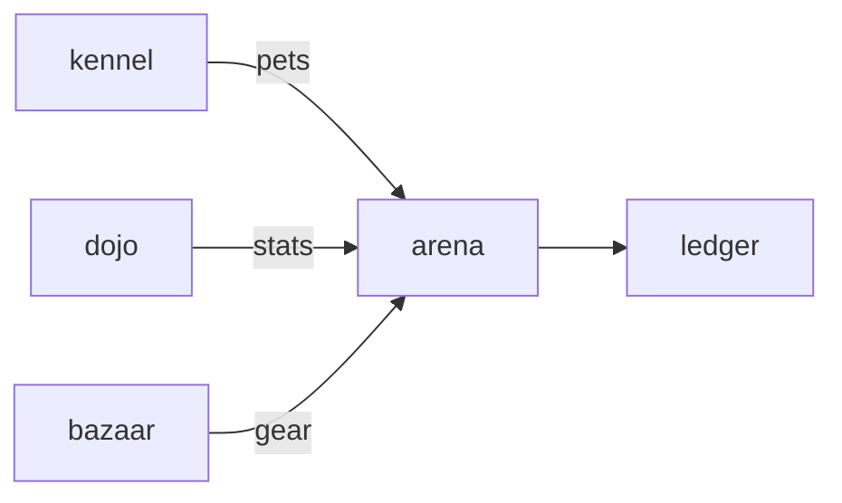

# Arena

**Pet Arena Battles** — Turn-based auto-battler using live pet stats and NFT gear as loadout.

Part of [ComputerPets](https://github.com/RicheyWorks/computerpets). Map: [computerpets-ecosystem](https://github.com/RicheyWorks/computerpets-ecosystem).

| | |
| --- | --- |
| Status | Design scaffold — loop and engine frozen |
| License | MIT |
| Tokens | Minigames never mint or burn. Tired overlay, not a dead lineage. |
| First pet | [Meet Rui first](https://github.com/RicheyWorks/computerpets/blob/main/docs/START-HERE.md). This game is optional. |

## The loop

Rui does not leave the desktop to fight. Arena is the coliseum: 210 kinds, mood and stamina from the overlay, gear from Bazaar. A hungry pet underperforms. A well-cared pet hits above its rarity.

## Who plays

Players who want a fight without leaving the canon.

## What it is not

Not a place to lose an NFT. Hungry pets underperform; cash does not buy a faster species.

## Genre and engine

- Genre: **Auto-battler**
- Engine: **Unity / WebGL**
- Stack: Unity 6 · C# · WebGL export · NFT gear from Minter · stats from flagship vitals
- Default surface: `WebGL / Unity editor`

## Architecture



## How you play

1. Draft 3 pets from your kennel.
2. Gear slots: hat / mark / accessory (legal trait slots only).
3. Auto-resolve rounds; you pick stance (guard, frenzy, trick) between rounds.
4. Winner takes treat-coin via Ledger, never the opponent NFT.

## First slice

Build this and stop.

**3v3 auto-battle, Rui vs dummy, stance pick between rounds, treat-coin purse via Ledger.**

You know it works when: Disconnect: 60s reconnect then forfeit treats, not pets. Illegal hybrid loadout rejected at lock-in.

## Environment

Unity 6. `API_BASE` for vitals lock-in.

## Failure doctrine

Disconnect mid-fight → pause + 60s reconnect, then forfeit treats not pets. Illegal hybrid loadout → reject at lock-in. WebGL GPU fail → desktop overlay still walks.

Canon rules that never yield:

- 210 living kinds. No illegal hybrids.
- Overlay pets can get tired, sick, or hide. Tokens are not burned by a minigame.
- Desktop walk stays the main quest. Closing Arena must leave Rui walking.

## Neighbors

- computerpets (vitals)
- computerpets-minter (gear tokens)
- computerpets-bazaar
- computerpets-ledger
- computerpets-dojo (trained stats)

## Layout

```
computerpets-arena/
  README.md
  LICENSE
  docs/DESIGN.md
  src/                implementation lands here
```

## Run (Windows)

```powershell
Open Arena/ in Unity Hub; File > Build Settings > WebGL. Or npm run preview after export.
```

Meet Rui first via the [flagship start-here](https://github.com/RicheyWorks/computerpets/blob/main/docs/START-HERE.md). This game is optional.

## Links

- Flagship: [RicheyWorks/computerpets](https://github.com/RicheyWorks/computerpets)
- This repo: [RicheyWorks/computerpets-arena](https://github.com/RicheyWorks/computerpets-arena)
- Map: [RicheyWorks/computerpets-ecosystem](https://github.com/RicheyWorks/computerpets-ecosystem)
- Design file: [docs/DESIGN.md](docs/DESIGN.md)

## License

MIT. See [LICENSE](LICENSE).

---

*Two hundred ten living kinds. Keep them so a line does not go quiet.*
