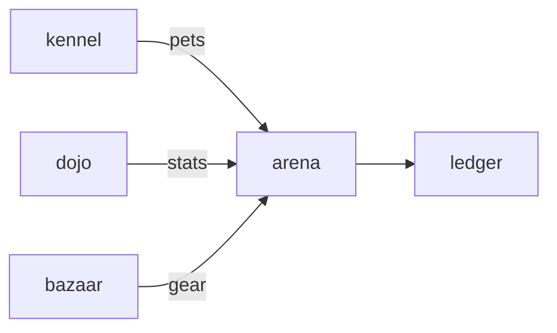

# Arena

**Care-driven battles for ComputerPets.**

A planned auto-battler where pet vitals, legal gear, and between-round stances shape the match.

**Stage: design scaffold.** This checkout contains a design document and a source placeholder. The experience below is planned; there is no runnable app or integrated service yet.

[Status](#status) · [Planned experience](#planned-experience) · [Contributor quickstart](#contributor-quickstart) · [Game design](docs/DESIGN.md) · [Ecosystem map](https://github.com/RicheyWorks/computerpets-ecosystem)

## Status

| Available today | What you can inspect |
| --- | --- |
| [Game design](docs/DESIGN.md) | Intended behavior, boundaries, and planned dependencies. |
| [Source placeholder](src/Game.cs) | Empty C# class; no Unity project or scene is checked in. |
| [MIT license](LICENSE) | Licensing terms for the repository. |

Gameplay, endpoints, integration arrows, and failure handling on this page describe implementation targets. No build/test harness, CI workflow, or product screenshots are included in this scaffold.

## Planned experience

- Draft 3 pets from your kennel.
- Gear slots: hat / mark / accessory (legal trait slots only).
- Auto-resolve rounds; you pick stance (guard, frenzy, trick) between rounds.
- Winner takes treat-coin via Ledger, never the opponent NFT.

### Planned technology

- Genre: **Auto-battler**
- Engine: **Unity / WebGL**
- Stack: Unity 6 · C# · WebGL export · NFT gear from Minter · stats from flagship vitals
- Default surface: `WebGL / Unity editor`

### Planned connections

These arrows show intended dependencies, rather than working integrations.



## Contributor quickstart

With access to this private repository, Git and PowerShell are enough to review the scaffold:

```powershell
git clone https://github.com/RicheyWorks/computerpets-arena.git
Set-Location computerpets-arena
Get-Content docs/DESIGN.md
Get-Content src/Game.cs
```

Read [Game design](docs/DESIGN.md) before choosing implementation details. The commands above inspect the checked-in files; app installation, editor launch, and server startup become possible after a buildable project and entry point are added.

### First implementation target

**3v3 auto-battle, Rui vs dummy, stance pick between rounds, treat-coin purse via Ledger.**

You know it works when: Disconnect: 60s reconnect then forfeit treats, not pets. Illegal hybrid loadout rejected at lock-in.

Treat this as an acceptance target for a future implementation. Start with the documented slice, add the required project setup and focused tests, and update these instructions with commands that work from a fresh clone.

## Design boundaries

1. Minigames cannot mint or burn NFTs by themselves (Minter is the write path).
2. Stats come from lived overlay care + Dojo caps, not cash shop.
3. Species kits stay inside Lore. Illegal hybrids never spawn.
4. Fail soft: the desktop overlay process is not this process.

**Required failure behavior:**

Disconnect mid-fight → pause + 60s reconnect, then forfeit treats not pets. Illegal hybrid loadout → reject at lock-in. WebGL GPU fail → desktop overlay still walks.

## Ecosystem

- [computerpets](https://github.com/RicheyWorks/computerpets) (vitals)
- [computerpets-minter](https://github.com/RicheyWorks/computerpets-minter) (gear tokens)
- [computerpets-bazaar](https://github.com/RicheyWorks/computerpets-bazaar)
- [computerpets-ledger](https://github.com/RicheyWorks/computerpets-ledger)
- [computerpets-dojo](https://github.com/RicheyWorks/computerpets-dojo) (trained stats)

Start with the [ComputerPets flagship](https://github.com/RicheyWorks/computerpets) for the desktop pet. This repository describes an optional extension; the [ecosystem map](https://github.com/RicheyWorks/computerpets-ecosystem) explains the broader plan.

## License

MIT. See [LICENSE](LICENSE).
